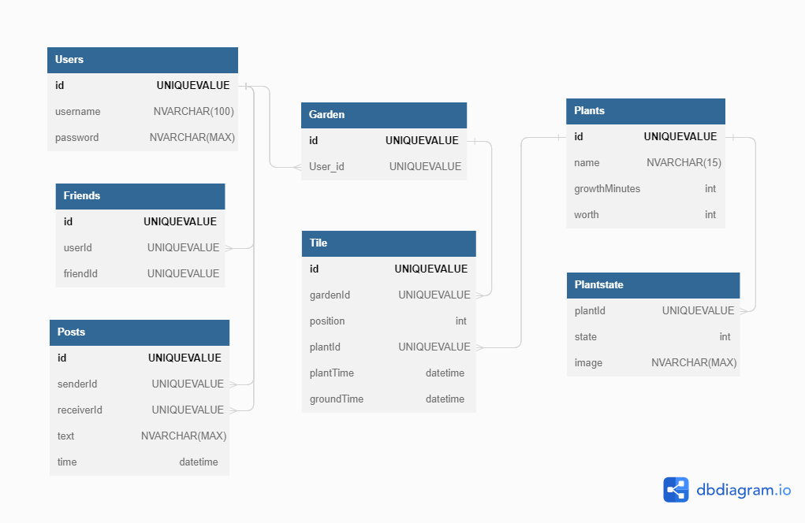

# P2-Virtual-Garden
Project 2 - Rushay, Jacob, Chi, Duncan

-	Project Overview
    -	A social media site where users can come together to share their love of plants by maintaining a virtual garden.
-	MVP goals
    -	As a user, I should be able to login
    -	As a user, I should be able to register
    -	As a user, I should be able to create and maintain a garden visible to other users
    -	As a user, I should be able to add plants with names and a looks
    -	As a user, I should have a post feed that allows me to view other people’s gardens, save updates to a diary other people can look at.
    -	As a user, I should be able to like other user’s plants to speed up grow times
    -	As a user, I should be able to post notes on other people’s plants/garden
    -	Plant’s growth can be sped up be tending to them (add fertilizer, pet them, etc.)
    -	Let’s say growth time of 10 minuet growth cycle. 2 minuets as a seed, 5 minutes as spout, 3 minutes as bud, after 10 minutes its finished.
    -	5 plants we can grow
        -	Rose
        - Daisy
        - Pumpkin
        -	Citrus
        - Sunflower
    - Sprite for dry ground/wet ground
        - Slight grow speedup
    - Profile Picture
- Stretch Goals
    - Plant’s wilt if left untended for awhile
    - Plant’s growth is affected by the weather
    - Password hashing
    - Inventory/Marketplace
    - Larger plants that take up more than one grid space 
- ERD
     - 
- FrontEnd Design
    -

- External API
    - Weather API to set the mood the page
